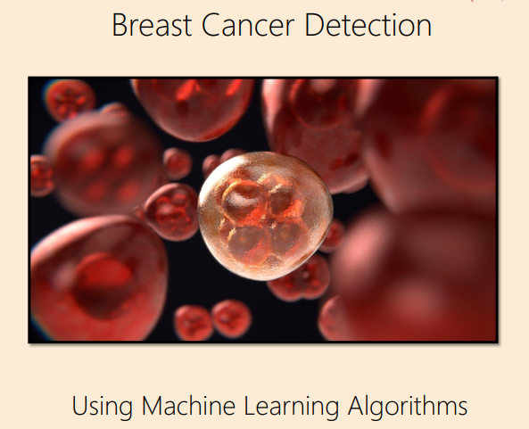

# Breast Cancer Detection from Scratch 🩺🔍

Welcome to Breast Cancer Detection from Scratch! This is a machine learning project that uses Python to detect breast cancer from medical images.

## Overview 📝

This project uses the [Wisconsin Breast Cancer dataset](https://archive.ics.uci.edu/ml/datasets/Breast+Cancer+Wisconsin+(Diagnostic)) to train a machine learning model to classify tumors as either benign or malignant. The model is implemented from scratch in Python.

## Project Report

[Link to Project Report](https://drive.google.com/file/d/1x0yEiS5kF-obl2P6bD18dk3bSvmMJiMH/view?usp=sharing)

# Breast cancer detection using : 

## Gradient Descente from scratch : 

[GD_Breast_cancer.py](https://github.com/Daeels/Breast_Cancer_Detection_From_Scratch/blob/main/GD_Breast_cancer.py)

## Stochastic Gradient Descente from scratch :

[SGD_Breast_cancer.py](https://github.com/Daeels/Breast_Cancer_Detection_From_Scratch/blob/main/SGD_Breast_cancer.py)

## Stochastic Gradient Descente the SGDClassifier from scikit learn linear_model :

[SGDClassifier_Breast_cancer.py](https://github.com/Daeels/Breast_Cancer_Detection_From_Scratch/blob/main/SGDClassifier_Breast_cancer.py)

## Contact 📧
If you have any questions or concerns, please feel free to contact me at [ilyasirgui@gmail.com](mailto:ilyasirgui@gmail.com).

